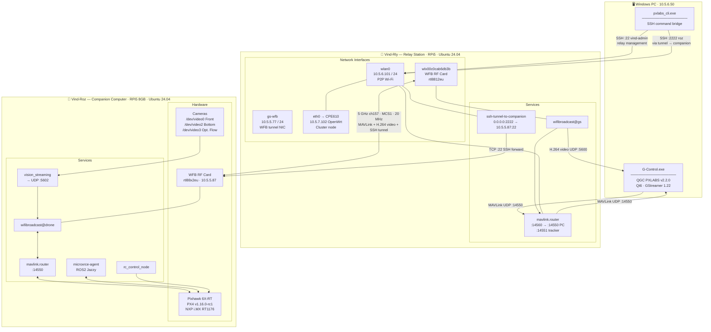

# System Architecture — G-Control / PXLABS Vind-Roz

Full network, data-flow, and software architecture for the Vind-Roz drone system.

---

## Node Overview

| Node | Hardware | OS | Role |
|------|----------|----|------|
| **Windows PC** | Desktop / laptop | Windows 11 | GCS — G-Control.exe |
| **Vind-Rly** | RPi5 | Ubuntu 24.04 | Relay station — WFB ground side, SSH tunnel, MAVLink router |
| **Vind-Roz** | RPi5 8GB | Ubuntu 24.04 | Companion — PX4, ROS2, cameras, WFB drone side |

---

## Architecture Diagram



---

## Data Flows

### MAVLink (telemetry + commands)
```
Pixhawk ──/dev/ttyAMA0:921600──► mavlink.router (companion)
    └──► WFB-NG drone (stream 0x10/0x90)
         └──► WFB-NG gs  (stream 0x90/0x10)
              └──► mavlink.router (relay) :14560
                   └──► G-Control.exe UDP :14550
```

### Video (H.264 downlink)
```
Camera /dev/video0 or /dev/video2
    └──► vision_streaming (FFmpeg H264 RTP → 127.0.0.1:5602)
         └──► WFB-NG drone (stream 0x00, FEC k=8 n=12)
              └──► WFB-NG gs
                   └──► G-Control.exe UDP :5600 → GStreamer display
```

### SSH Tunnel (companion access from PC)
```
pxlabs_cli.exe  SSH :2222
    └──► Relay wlan0 :2222
         └──► ssh-tunnel-to-companion (WFB tunnel stream 0xa0/0x20)
              └──► gs-wfb 10.5.5.77 ↔ drone-wfb 10.5.5.87
                   └──► Companion :22  (user: roz)
```

### SSH Direct (relay management)
```
pxlabs_cli.exe  SSH :22
    └──► Relay wlan0 10.5.6.101:22  (user: vind-admin)
```

---

## WFB-NG Link Parameters

| Parameter | Value | Notes |
|-----------|-------|-------|
| `wifi_channel` | 157 | 5 GHz |
| `wifi_region` | `BO` | Higher TX power allowed |
| `wifi_txpower` | 3000 (30 dBm × 100) | rtl8812eu |
| `mcs_index` | 1 | BPSK 1/2 — ~7 Mbps, robust |
| `bandwidth` | 20 MHz | All streams |
| `stbc` | 1 | Space-time block coding |
| `ldpc` | 1 | Low-density parity-check |
| `temp_overheat_warning` | 60 °C | Air-TX chip alert in G-Control toolbar |

### WFB-NG Streams

| Stream | Direction | Stream ID | FEC | Purpose |
|--------|-----------|-----------|-----|---------|
| `video` | Drone → Relay | 0x00 | k=8, n=12 | H264 video downlink |
| `mavlink` | Bidirectional | 0x10 / 0x90 | k=1, n=2 (drone) / n=3 (relay) | MAVLink up + downlink |
| `tunnel` | Bidirectional | 0xa0 / 0x20 | k=2, n=4 | SSH tunnel (drone-wfb ↔ gs-wfb) |

---

## Software Stack

### G-Control.exe (Windows)

| Layer | Component |
|-------|-----------|
| GCS framework | QGroundControl v5.0.8 (base) |
| PXLABS UI | `FlyViewCustomLayer.qml` — System Control panel |
| Toolbar | `FlyViewToolBar.qml` — Air-TX temp chip, Comp/Relay status chips |
| Settings pages | ConnectionControl, PXLABSSettings, CompanionControl, RelayControl |
| Command bridge | `PXLABSCommandRunner.cc` — QProcess → pxlabs_cli.exe |
| Video decode | GStreamer 1.22.12 — H264 via d3d11h264dec (no gstlibav) |
| CLI tool | `pxlabs_cli.exe` — PyInstaller-frozen Python, Windows keyring auth |

### Companion (Vind-Roz)

| Service | Purpose |
|---------|---------|
| `wifibroadcast@drone` | WFB-NG drone side — video TX, MAVLink + tunnel bidirectional |
| `mavlink.router` | /dev/ttyAMA0:921600 ↔ WFB MAVLink peer |
| `microxrce-agent` | /dev/ttyAMA4:921600 ↔ ROS2 DDS bridge |
| `vision_streaming` | FFmpeg camera → H264 RTP → WFB video stream |
| `rc_control_node` | ROS2 RC input node |
| `block-traffic` | Drops ROS2 DDS multicast on drone-wfb (saves WFB bandwidth) |
| `system_files_sync.timer` | Periodic config sync |

### Relay (Vind-Rly)

| Service | Purpose |
|---------|---------|
| `wifibroadcast@gs` | WFB-NG ground side — video RX, MAVLink + tunnel bidirectional |
| `mavlink.router` | WFB MAVLink peer → UDP :14550 (PC) + :14551 (tracker) |
| `ssh-tunnel-to-companion` | Forwards 0.0.0.0:2222 → 10.5.5.87:22 via WFB tunnel NIC |
| `relay_files_sync.timer` | Periodic config sync |

---

## Network Addresses

| Node | Interface | Address | Purpose |
|------|-----------|---------|---------|
| Windows PC | Wi-Fi | 10.5.6.50 | P2P network |
| Vind-Rly | wlan0 | 10.5.6.101 | P2P network |
| Vind-Rly | gs-wfb | 10.5.5.77 | WFB tunnel endpoint |
| Vind-Rly | eth0 | → CPE610 10.5.7.102 | Cluster (OpenWrt) |
| Vind-Roz | drone-wfb | 10.5.5.87 | WFB tunnel endpoint + SSH |

---

## Encryption

WFB-NG uses a symmetric keypair per link:
- `/etc/drone.key` — present on both companion and relay (drone keypair)
- `/etc/gs.key` — present on both companion and relay (GS keypair)
